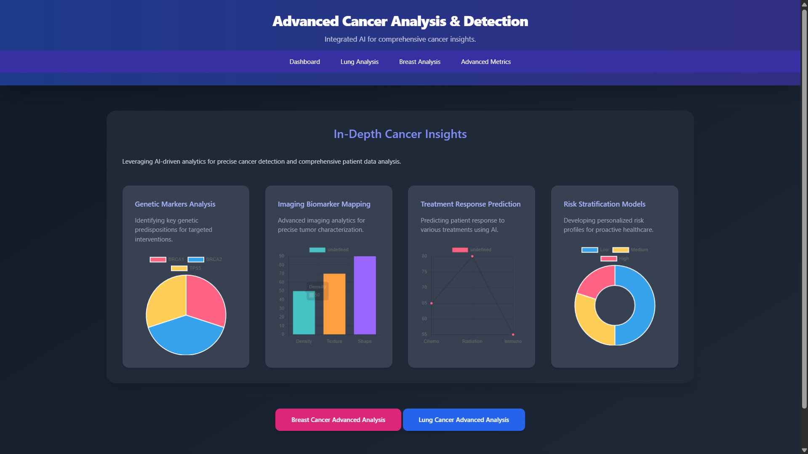
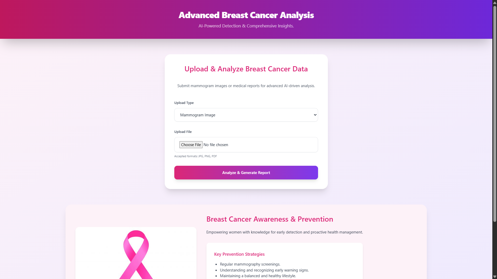
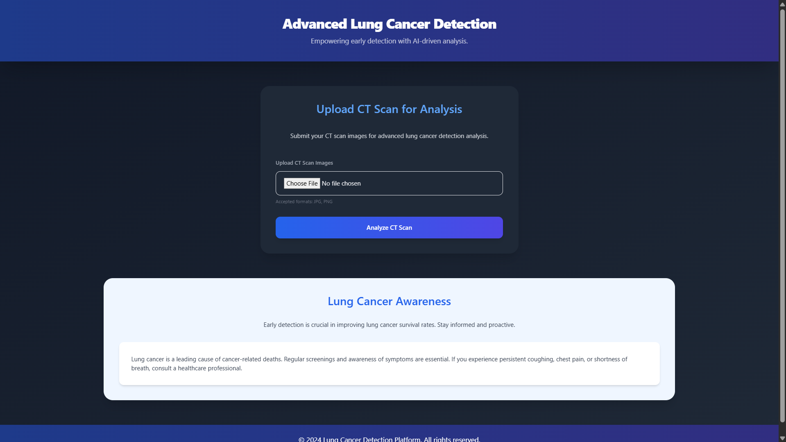
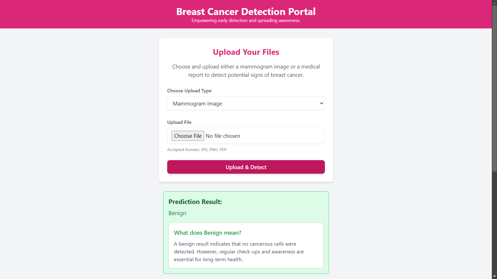

# Cancer Detection Hub using Machine Learning  

## Table of Contents  
- [Introduction](#introduction)  
- [Features](#features)  
- [Technologies Used](#technologies-used)  
- [Dataset](#dataset)  
- [How It Works](#how-it-works)  
- [Installation](#installation)  
- [Usage](#usage)  
- [Screenshots](#screenshots)  
- [Future Enhancements](#future-enhancements)  

---

## Introduction  

The **Cancer Detection Hub** is a machine learning-based system designed to assist in the early detection of both breast and lung cancer. The hub leverages structured data and MRI scans to provide accurate predictions, classifying tumors as benign or malignant. Early detection is crucial for timely medical intervention, and this project makes it accessible through technology.  

---

## Features  
- **Breast Cancer Detection:**  
  Uses structured data from the Breast Cancer Wisconsin Dataset to classify tumors as benign or malignant.  
- **Lung Cancer Detection:**  
  Analyzes MRI scans to predict the nature of the tumor.  
- **User-Friendly Hub:**  
  A simple interface for uploading data or MRI scans and receiving instant predictions.  

---

## Technologies Used  
- **Programming Language:** Python  
- **Framework:** Django  
- **Libraries:**  
  - NumPy  
  - Pandas  
  - Scikit-learn  
  - TensorFlow/Keras (for CNN implementation)  
  - Matplotlib (for visualizations)  

---

## Dataset  
### Breast Cancer:  
- Dataset: Breast Cancer Wisconsin Dataset  
- Source: [Machine Learning Repository](https://www.kaggle.com/datasets/uciml/breast-cancer-wisconsin-data?resource=download)  

### Lung Cancer:  
- MRI scans dataset.
- Source:[CT & MRI Scans-datasets](https://www.kaggle.com/datasets/mohamedhanyyy/chest-ctscan-images)

---

## How It Works  
1. **Data Input:**  
   - Users can upload structured data for breast cancer or MRI/CT scans for lung cancer.  
2. **Preprocessing:**  
   - The system preprocesses the input data to make it suitable for the model.  
3. **Model Prediction:**  
   - For breast cancer: Support Vector Machine (SVM) model.  
   - For lung cancer: Convolutional Neural Network (CNN) model.  
4. **Result:**  
   - Outputs whether the tumor is benign or malignant.  

---

## Installation  

1. Clone the repository:  
   ```bash  
   git clone https://github.com/vedang18200/Breast-Cancer-Detection-by-Machine-Learning-.git
   ```
2.Navigte to the directory:
  ```bash
   cd Breast-Cancer-Detection-by-Machine-Learning-
  ```
3.Create and activate a virtual environment:
  ```bash 
  python -m venv venv
  source venv/bin/activate
  ```
4.Install dependencies:
 ```bash
  pip install -r requirements.txt
 ```
5.Set up the database:
 ```bash
  python manage.py makemigrations
  python manage.py migrate
 ```
6.Run the development server:
 ```bash
 python manage.py runserver
 ```
7.Access the app in the browser:
  ```bash
  http://127.0.0.1:8000/
  ```

---

## Usage 
1.Upload structured data for breast cancer detection or MRI scans for lung cancer detection.
2.Click on the "Predict" button.
3.View the results indicating whether the tumor is benign or malignant.

---
## Screenshots  

1. **Home Page:**  
     

3. **Breast Cancer Detection Input:**  
     

4. **Lung Cancer Detection Input:**  
     

5. **Prediction Results:**  
     

---
## Future Enhancements
 - Include additional cancer types for detection.
 - Improve the accuracy of the models with more training data.
 - Add a feature for exporting the results to a PDF report.
 - Make the hub accessible online for broader usage.
 - Integrate advanced preprocessing techniques for MRI scans.

---


